# OnlyPets

Projekt zaliczeniowy laboratorium przedmiotu **"Aplikacje internetowe 1"**.

OnlyPets to aplikacja webowa zrealizowana w modelu MVC inspirowana OnlyFans, ale przeznaczona dla miłośników zwierząt. Użytkownicy mogą publikować zdjęcia swoich pupili i udostępniać je innym w modelu subskrypcyjnym.

## Opis projektu
Aplikacja umożliwia interaktywne zarządzanie treściami dotyczącymi zwierząt poprzez:
- Rejestrację i logowanie użytkowników
- Publikowanie postów ze zdjęciami zwierząt
- Subskrypcje treści innych użytkowników
- Przeglądanie i interakcję z treściami
- Personalizację profilu użytkownika
- Wyszukiwanie użytkowników

Aplikacja jest **w pełni responsywna**, dostosowana do różnych urządzeń. Pełna dokumentacja znajduje się w pliku **Dokumentacja.pdf**.

## Technologie i narzędzia
Projekt wykorzystuje następujące technologie:

- **Backend:** Laravel 11 (PHP 8.2)
- **Frontend:** Blade, Bootstrap 5
- **Baza danych:** MySQL
- **Narzędzia:** XAMPP, Composer
- **Dodatkowe biblioteki:** Emoji Mart

## Struktura bazy danych
Baza danych aplikacji obejmuje kluczowe tabele:
- **users** – przechowuje dane użytkowników
- **posts** – przechowuje posty użytkowników
- **posts_attachments** – przechowuje załączniki do postów
- **subscriptions** – przechowuje dane o subskrypcjach użytkowników
- **roles** – przechowuje role użytkowników

### Diagram ERD
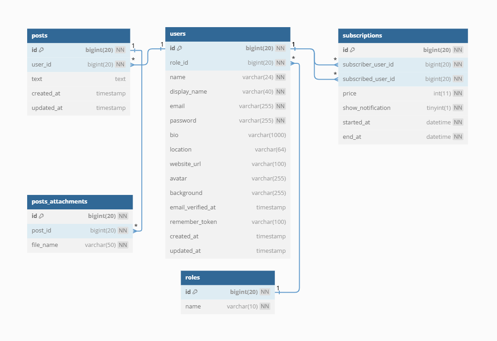

## Funkcjonalności aplikacji
- Logowanie i rejestracja użytkowników
- Publikacja postów ze zdjęciami
- Przeglądanie postów z mechanizmem endless scrolling inspirowanym platformą społecznościową X
- System subskrypcji z płatnym dostępem do treści
- Personalizacja profilu użytkownika
- Wyszukiwanie użytkowników
- System powiadomień
- System rang nagradzający stałych użytkowników za ich aktywność
- Panel administratora

## Instalacja i uruchomienie

### Wymagania
- XAMPP 8.2.12 (Apache + MySQL)
- Composer 2.7.6
- PHP 8.2

### Kroki instalacji
1. Pobranie repozytorium:
   ```sh
   git clone https://github.com/krzysztofmotas/onlypets.git
   cd onlypets
   ```
2. Instalacja zależności:
   ```sh
   composer install
   ```
3. Konfiguracja pliku `.env`
4. Wygenerowanie klucza aplikacji:
   ```sh
   php artisan key:generate
   ```
5. Migracja i seeding bazy danych:
   ```sh
   php artisan migrate:fresh --seed
   ```
6. Stworzenie symbolic links dla przechowywania plików:
   ```sh
   php artisan storage:link
   ```
7. Uruchomienie serwera deweloperskiego:
   ```sh
   php artisan serve
   ```
8. Otworzenie aplikacji w przeglądarce pod adresem `http://localhost:8000`

## Przykładowe konta testowe
- **Administrator:**
  - Email: `kotszeryf@email.com`
  - Hasło: `1234`
- **Użytkownik:**
  - Email: `chomikhenio@email.com`
  - Hasło: `1234`

## Zrzuty ekranu
### Strona główna
<div style="display: flex; flex-direction: row; gap: 10px;">
    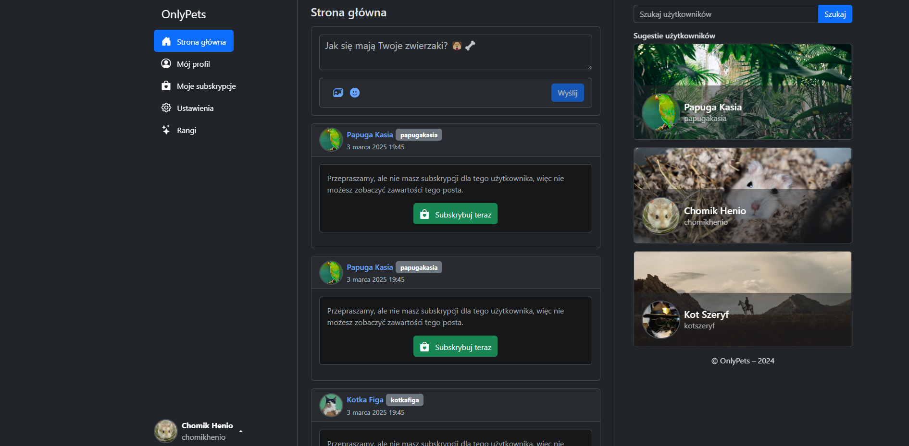
    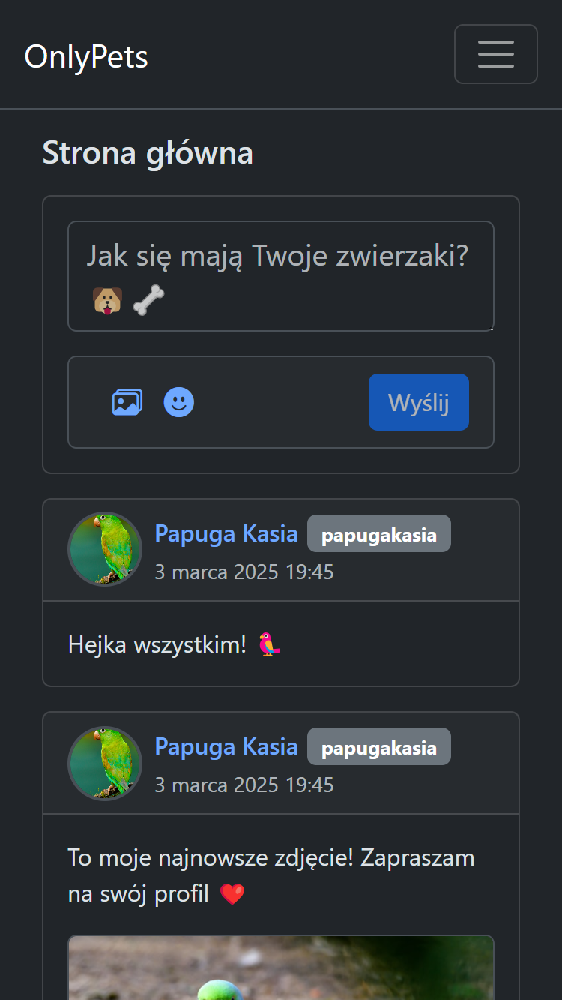
</div>

### Profil użytkownika
<div style="display: flex; flex-direction: row; gap: 10px;">
    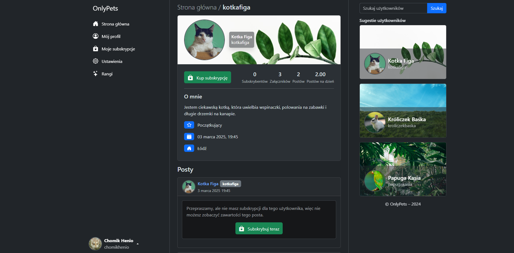
    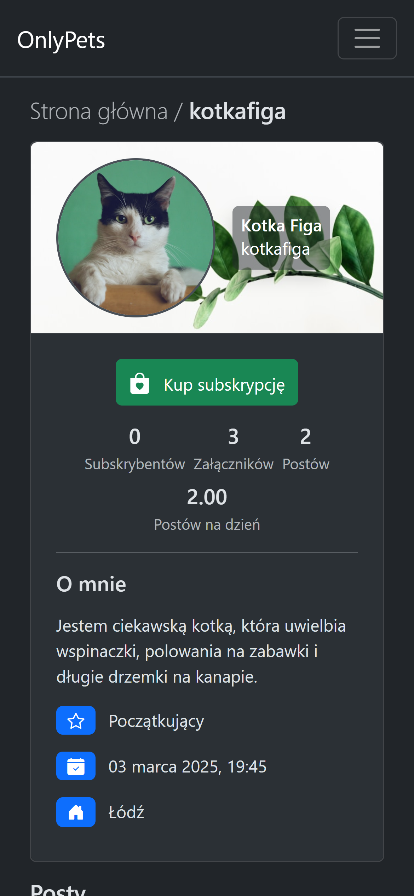
</div>

### Subskrypcje
<div style="display: flex; flex-direction: row; gap: 10px;">
    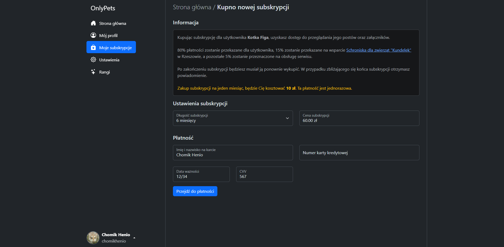
    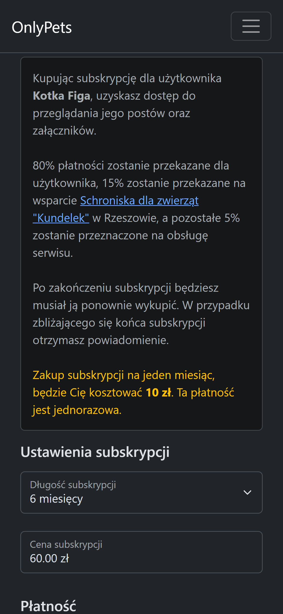
</div>

<div style="display: flex; flex-direction: row; gap: 10px; margin-top: 10px;">
    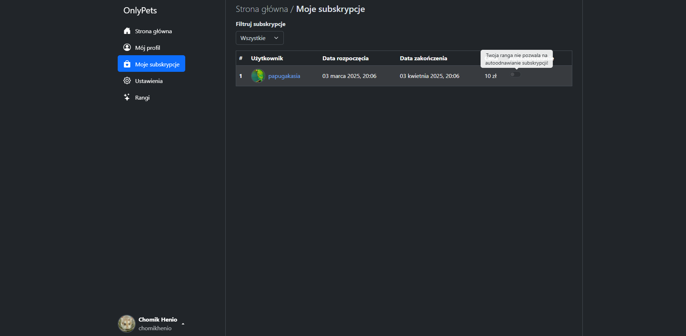
    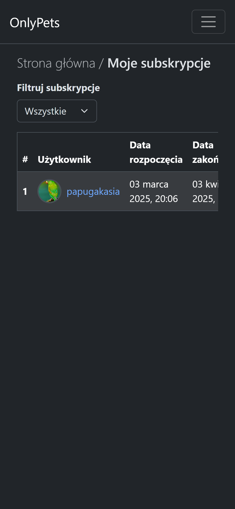
</div>

### Rangi
<div style="display: flex; flex-direction: row; gap: 10px;">
    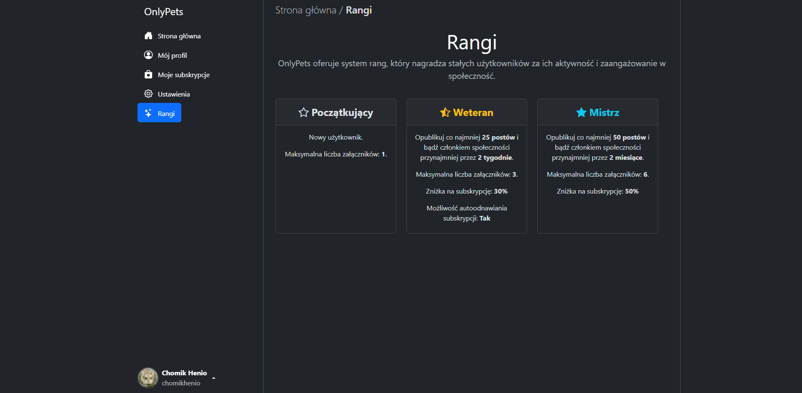
    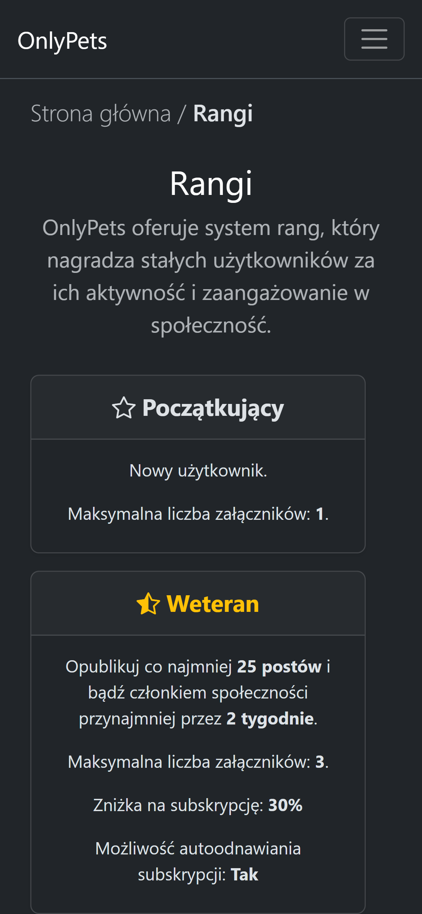
</div>

